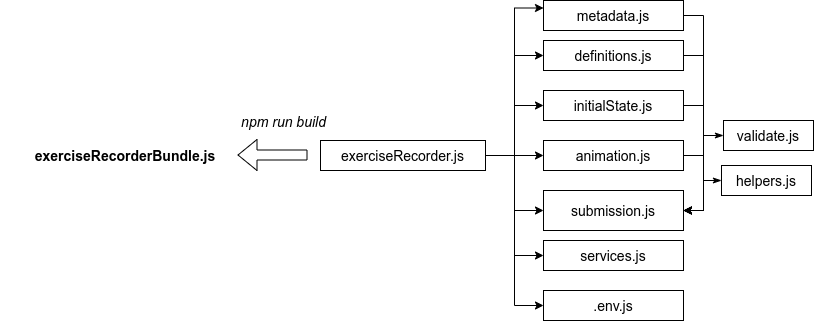

## To run the tests
The tests are written with Jest. To run the tests do this directory:

`npm install`

`npm run test`

## Define the environment variables
Create a `.env.js` file with and define *EXEC_ENV* and *SUBMISSION_URL*. For example:
```
const EXEC_ENV = 'STATIC';
const SUBMISSION_URL = 'http://localhost:3000/submissions';

module.exports = {
  EXEC_ENV,
  SUBMISSION_URL
}
```
For static pages, which require the *exercise recorder* to initialize automatically when imported, define `EXEC_ENV = 'STATIC'`.

For dynamic pages, where you **do not** want the *exercise recorder* to initialize automatically, define `EXEC_ENV = 'DYNAMIIC'`.

If you want to store the submission data in the *window* global object, define `SUBMISSION_URL = ''`.

The *initializeRecorder()* and *detachRecorder()* methods are also exposed through the *window* global object. So you can use them to initialize and detach at will.

## Bundle required modules
To bundle all the required modules in one file use [Browserify](http://browserify.org/):
`npm install -g browserify`
`browserify exerciseRecorder.js > build/bundle.js`
Then add the bundle to the exercise html file using a `<script>` tag like:
`<script src="<PATH>/<TO>/build/bundle.js"></script>`

Alternatively you can *import* or *require* the bundle file.

## Saving the submission data
The submission object is sent the server if *SUBMISSION_URL* is defined in `.env.js` otherwise it is saved in the *window* global object.

## Example use with React
`SUBMISSION_URL = ''`
```
...
import "../jsav-exercise-recorder/build/exercise_recorder-bundle.js";
...
componentDidMount() {
  if(window.$ !== undefined){
    window.initializeRecorder();
  } else {
    window.location.pathname = '/';
  }
}

componentWillUnmount() {
  window.detachRecorder();
}
...
```
