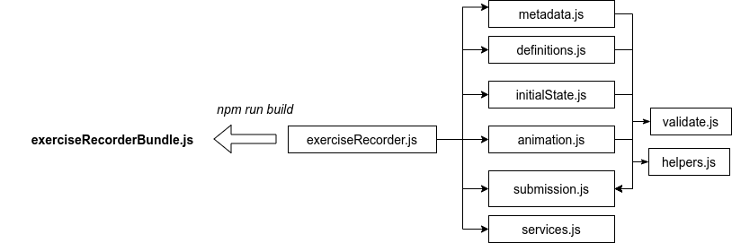
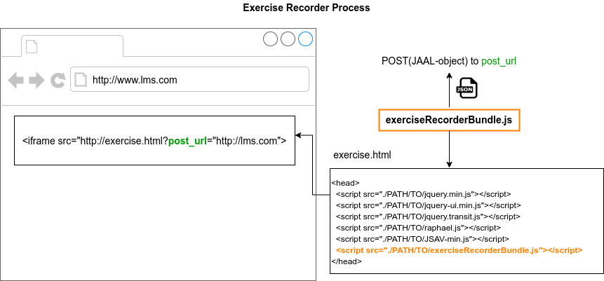

# JSAV Exercise Recorder

The JSAV Exercise Recorder is a JavaScript software for creating recordings of
Visual Algorithm Simulation exercises. It is based on
[JSAV](http://jsav.io) and [OpenDSA](https://github.com/OpenDSA/OpenDSA).
For extensive background information, see
[Giacomo Mariani's MSc thesis](https://aaltodoc.aalto.fi/handle/123456789/44448).

The Exercise Recorder initializes automatically when it is imported into an
HTML document. It starts listening for all JSAV log events. For this reason it
is important that the it is imported in the `<head>` element of the HTML
document, before the JSAV exercise is loaded.

Upon initialization the Exercise Recorder will look for the *post\_url* URL
parameter, which should contain the URL where the recorded animation data has to
be posted. Instead of a URL, the *post\_url* can also contain the string
"window", in which case the recorded data will be posted to the window where the
Exercise Recorder has been loaded.

Currently the recorded data is sent to the given *post_url* when the user clicks
the grade button.

D

## To run the tests
The tests are written with Jest. To run the tests do this directory:
- `git checkout master`.
- `npm install` in the root folder of this project (if you have not done yet).
- `npm run test`.

## Build the bundle file
To bundle all the required modules in one file use [Browserify](http://browserify.org/):
- `git checkout master`.
- `npm install` in the root folder of this project (if you have not done yet).
- `npm install -g browserify` if you have not installed it yet.
- `browserify exerciseRecorder.js > build/jsav-exercise-recorder-bundle.js`.

- Add the bundle to the exercise HTML file `<head>` element using a ``.

## How the Exercise Recorder works

When an HTML document containing the Exercise Recorder and the JSAV-based
exercise is loaded, the execution from the source code perspective begins at
file exerciseRecorder.js.
