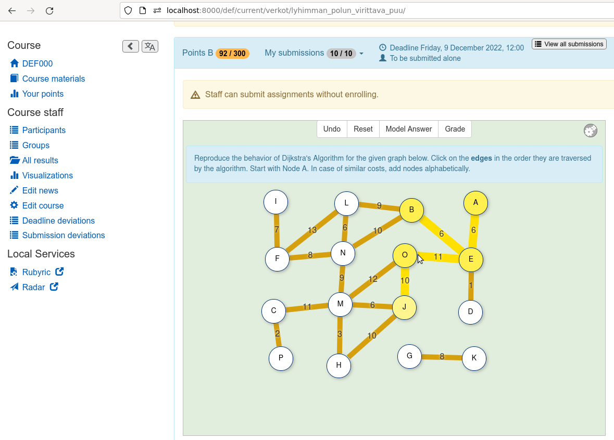
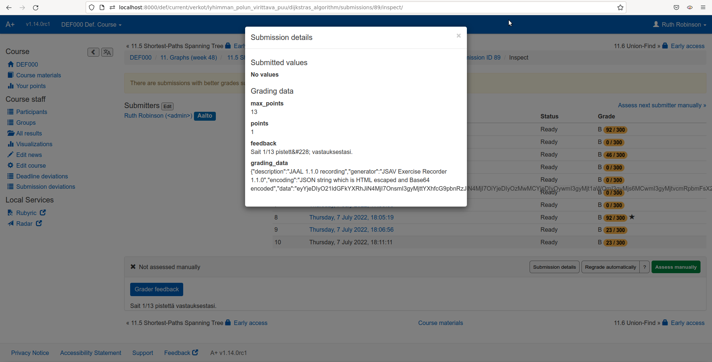

# Integration of the exercise recorder into DSA Y course

This document discusses how to integrate the JSAV Exercise Recorder into the
Aalto University course CS-A1143 Data Structures and Algorithms Y ("DSA Y").

## Building the Recorder and Player into DSA Y

Assumptions:
- JSAV Exercise Recorder is cloned at `<some_dir>/jsav-exercise-recorder`
- JSAV Exercise Player is cloned at   `<some_dir>/jsav-exercise-player`
- DSA Y course is cloned at           `<some_dir>/traky`

Clone those, if you have not done that yet.
Branch `jaal` is the development branch for JAAL-DSA-Y integration.

```
git clone -b jaal git@version.aalto.fi:course/traky.git
cd traky/exercises/jsav/jaal/
./compile-jaal.sh
```


For more information, see the file `exercises/jsav/jaal/README.md` in the
source code of [Data Structures and Algorithms
Y](https://version.aalto.fi/gitlab/course/traky).

## Testing the integration manually

Then, in another terminal, go to `<some_dir>/traky`. As usual, compile the
course and run A+ locally.
```
./docker-compile.sh 1143
./docker-up.sh
```

The Dijkstra's algorithm exercise should now be available in the course
material at [11. Graphs (week 48) 11.5 Shortest-Paths Spanning Tree](http://localhost:8000/def/current/verkot/lyhimman_polun_virittava_puu/).



Make a submission to the exercise as normal: click some edges and then
"Grade".

Go to [Inspect Submission view](http://localhost:8000/def/current/verkot/lyhimman_polun_virittava_puu/dijkstras_algorithm/submissions/). Click one
submission open, then click "Submission details."



Under *grading_data*, you should see the JSON data:

```
{
  "description": "JAAL 1.1.0 recording",
  "generator":"JSAV Exercise Recorder 1.1.0",
  "encoding":"JSON string which is HTML escaped and Base64 encoded",
  "data": "long string"
}

That "long string" is the actual JAAL recording.
