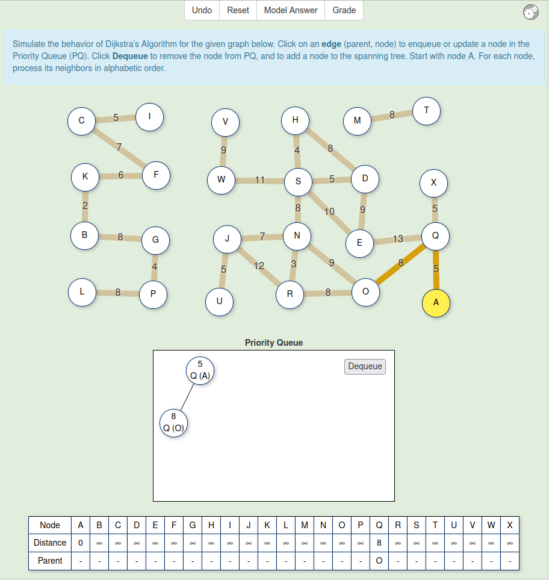
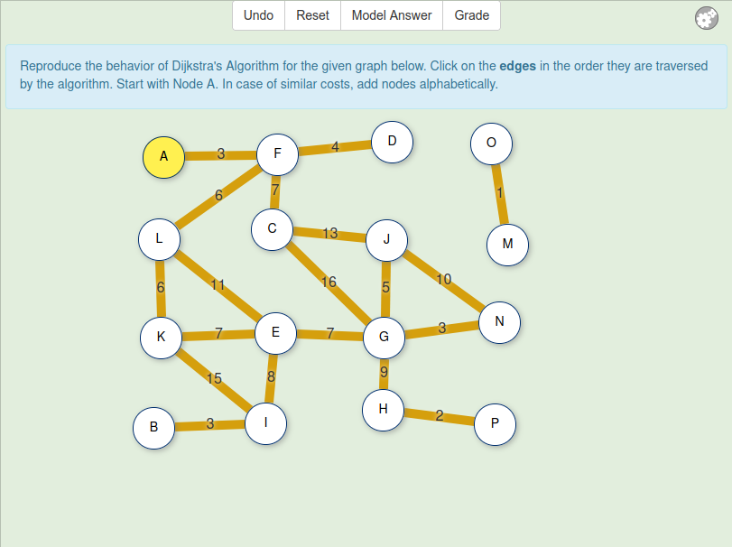
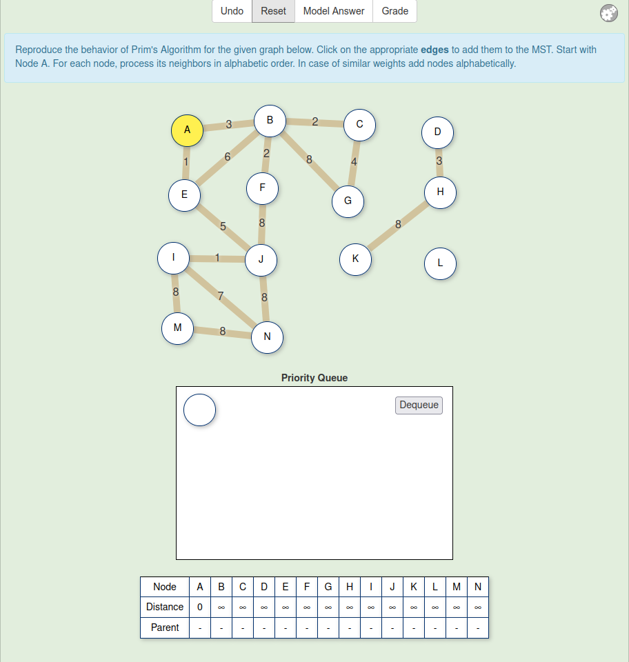
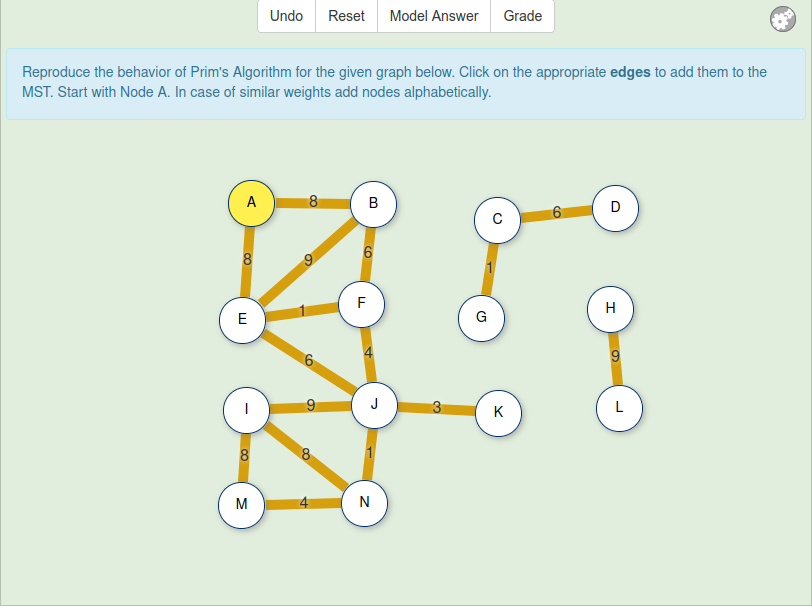

# doc/exercise_design

This directory contains statistics and designs for new versions of existing
JSAV exercises.

## Dijkstra's algorithm

Two research versions of Dijkstra's algorithm were developed in 2022.

### Scaffolded Dijkstra's algorithm

Location: `testbench/OpenDSA/AV/Development/DijkstraPE-research-v2.*`

This is the "scaffolded" version of the exercise. It contains a priority
queue interface as binary heap, similar to the old MatrixPro version. A
student must explicitly enqueue, dequeue, or update the nodes (edges) in the
priority queue. The exercise has a preconfigured template.

### Non-Scaffolded Dijkstra's algorithm

Location: `testbench/OpenDSA/AV/Development/DijkstraPE-research.*`

This is the "non-scaffolded" version of the exercise. It is similar to the
original OpenDSA version, but with no overlapping edges, and ensuring that
there are always two relaxations and two skipped edges in the simulation, if
it is done correctly. Here the student only clicks an edge when it is dequeued
from the priority queue. The exercise has a preconfigured template.

Background information on exercise instance generation: A. Tilanterä's M.Sc.
thesis, *Towards Automatic Advice in Visual Algorithm Simulation*, pp. 46-49.
[PDF at Aalto University](https://aaltodoc.aalto.fi/handle/123456789/44343).

## Prim's algorithm

### Scaffolded Prim's algorithm

Location: `testbench/OpenDSA/AV/Development/PrimAVPE-scaffolded.*`

This is similar to *Scaffolded Dijkstra's algorithm* exercise, except that
there is no preconfigured template.

### Non-scaffolded Prim's algorithm

This is similar to *Non-scaffolded Dijkstra's algorithm* exercise, except that
there is no preconfigured template.

Location: `testbench/OpenDSA/AV/Development/PrimAVPE.*`
